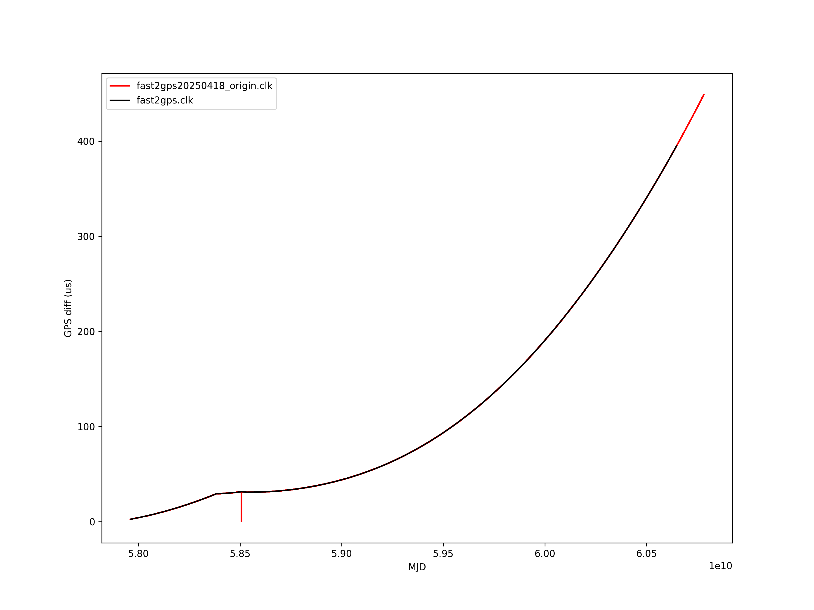

README
FAST clock file

Newer and smaller clock file in TEMPO2 format:</br>
https://crafts.bao.ac.cn/pub/fast/time/fast2gps.clk

update 20200814</br>
Download url:</br>
http://das101.china-vo.org/fast-pulsar/FAST-ClockFile/fast2gps20200814.clk


FAST 台站更新 201909/19 </br>
-1668557.0      5506838.0      2744934.0        FAST                fast


How to change to TEMPO2 clock file in PINT</br>

Find the file `pint/observatory/observatories.py` and edit it.</br>

Here's the example setting for FAST.</br>

```python
 TopoObs(
     "fast",
     tempo_code="k",
     itoa_code="FA",
     clock_fmt="tempo2",
     clock_dir="TEMPO2",
     clock_file="fast2gps.clk",
     itrf_xyz=[-1668557.0, 5506838.0, 2744934.0]
```

Here's the clock difference plot.</br>

